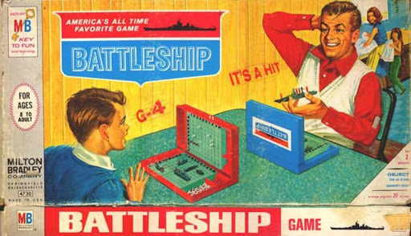

## Introduction

Battleship is a world-famous game originating as a paper-and-pencil game around the time of World War I in the 1930's before being released in it's more familar modern form by Martin Bradley in the 60's.  Most likely, this is a game that you have played more than once when you were younger, though if you are like me then it's been a while!

In Battleship, opposing players secretly arrange their ships on a  grid.  Then the players alternate making guesses of the locations of their opponents ships, attempting to get enough *hits* to sink the enemy fleet.  Are there good strategies for where to place the ships?  What about strategies for picking locations to fire?  It's up to you to find out!

### Rules

I know, I know, it's been a while!  Or maybe you've never played Battleship before, in which case you're in for a treat!  Take a moment to review the Basic Rules of Battleship (external link).

### Playing Online

We will be playing Battleship in pairs online using the website [BoomBoomBoat.com](http://BoomBoomBoat.com).  There you can play vs the computer, challenge a random stranger online, or face off against a friend in a private match.  Even better, you **do not need to register** in order to use the site!

To play with a friend:

* Click the button **Play with a friend**.
* Copy the link in the address bar and send it to a friend.  If you are on Zoom you can do this through the chat feature.
* Place your ships on the grid (or select the **Place randomly** button).
* Click the **Ready** button.

