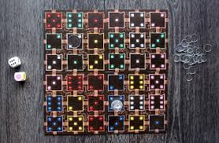

## How to Play
We aren't able to play micro-robots in person together due to the pandemic, so we'll have to improvise.  Use one of the links below to access an online implementation of Micro Robots, where you can play online!

### Playing Online 
* [Video tutorial on playing online](https://www.youtube.com/watch?v=g9jXe6CSEkU)

### List of Game Room Links
Below is a list of links where we can go to play Micro Robots.  Use the link for your particular group!

* Room 1: [https://playingcards.io/teacjk](https://playingcards.io/teacjk) 
* Room 2: [https://playingcards.io/nzpf2e](https://playingcards.io/nzpf2e) 
* Room 3: [https://playingcards.io/c8qrcz](https://playingcards.io/c8qrcz) 
* Room 4: [https://playingcards.io/qttrst](https://playingcards.io/qttrst) 
* Room 5: [https://playingcards.io/hmras6](https://playingcards.io/hmras6)
* Room 6: [https://playingcards.io/c7gzcy](https://playingcards.io/c7gzcy)
* Room 7: [https://playingcards.io/7ks7wc](https://playingcards.io/7ks7wc)

