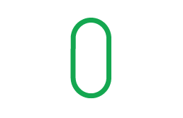

## What is SET

SET is an abstract board game.
The object of the game is to identify a SET of 3 cards from 12 cards placed face up on the table. Each card has four features:

* the **shape** of the symbols, either ovals, squiggles, or diamonds
* the **color** of the symbols, either red, purple, or green
* the **number** of the symbols, either 1, 2, or 3
* the **shading** of the symbols, either solid, striped, or empty

A SET consists of 3 cards in which each of the cards' features, looked at one‐by‐one, are the same on each card, or, are different on each card.
All of the features must separately satisfy this rule.
In other words:
* shape must be either the same on all 3 cards, or different on each of the 3 cards;
* color must be either the same on all 3 cards, or different on each of the 3 cards;
* etc.  See the examples below.

**Example 1:**
    
    
    

  

    
  

  

    
  

  

    
  

